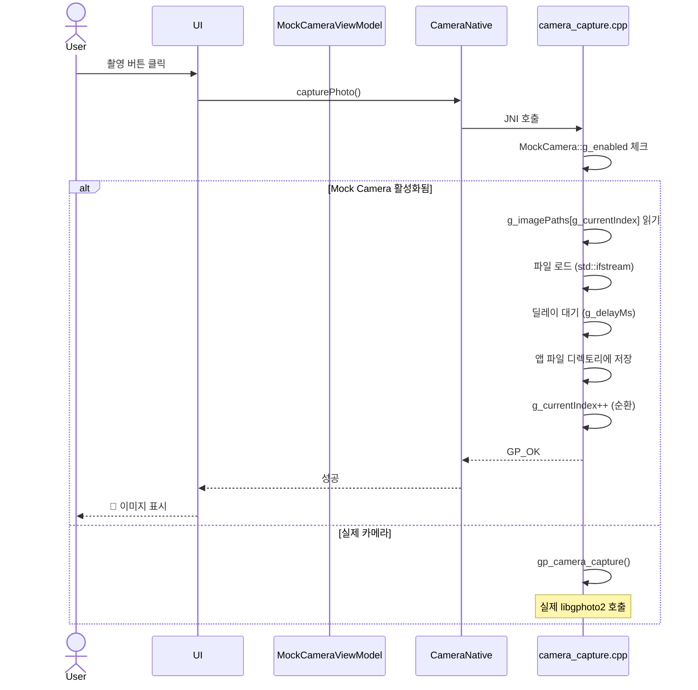

# 🧪 Mock Camera 사용 가이드 (ADMIN 전용)

## 개요

**Mock Camera**는 실제 DSLR/미러리스 카메라 없이도 CamConT 앱의 모든 기능을 테스트할 수 있는 가상 카메라 시스템입니다.

### 주요 기능

✅ **실제 카메라 시뮬레이션**: 선택한 카메라 모델(Canon, Nikon, Sony 등) 동작 재현  
✅ **이미지 순환 재생**: 갤러리에서 선택한 이미지들을 순환하며 촬영  
✅ **딜레이 조절**: 0~5초 사이 캡처 응답 시간 시뮬레이션  
✅ **자동 캡처**: 1~10초 간격으로 자동 촬영 (타임랩스 테스트용)  
✅ **에러 시뮬레이션**: 카메라 초기화 실패, 타임아웃 등 에러 상황 재현

## 접근 방법

### ADMIN 티어 전용 기능

Mock Camera는 **ADMIN 티어 사용자만** 사용할 수 있습니다.

```
Settings (설정) 
  → 🧪 가상 카메라 (ADMIN 전용)
    → Mock Camera 설정
```

## 사용 방법

### 1️⃣ 카메라 모델 선택

```
1. "카메라 모델 선택" 버튼 클릭
2. 제조사 선택 (Canon, Nikon, Sony, Fujifilm, Panasonic 등)
3. 해당 제조사��� 모델 선택 (예: Canon EOS R5)
4. 선택 완료
```

**지원 제조사 및 모델:**

| 제조사 | 주요 모델 |
|--------|----------|
| **Canon** | EOS R5, EOS R6, EOS 5D Mark IV, EOS 90D, EOS M50 |
| **Nikon** | Z9, Z7 II, D850, D780, D7500, D5600 |
| **Sony** | Alpha A7R IV, Alpha A7 III, Alpha A6600, ZV-E10 |
| **Fujifilm** | X-T4, X-T3, X-S10, GFX 100S, X100V |
| **Panasonic** | GH5, GH6, S5, G9, S1H, S1R |
| **Olympus** | OM-D E-M1 Mark III, OM-D E-M5 Mark III, PEN E-P7 |
| **Pentax** | K-3 III, K-1 Mark II, KP |

### 2️⃣ Mock 이미지 등록

```
1. "이미지 추가" 버튼 클릭
2. 갤러리에서 JPEG 이미지 선택 (다중 선택 가능)
3. 이미지가 앱 내부 저장소로 복사됨
```

**권장 이미지 사양:**

- 포맷: JPEG (.jpg, .jpeg)
- 해상도: 1920x1080 이상 (Full HD)
- 파일 크기: 5MB 이하 (성능 고려)
- 수량: 3~10개 (순환 테스트용)

### 3️⃣ Mock Camera 활성화

```
1. "Mock Camera 활성화" 스위치 ON
2. 메인 화면으로 돌아가기
3. USB 연결 대신 Mock Camera가 동작
4. 촬영 시 등록된 이미지가 순환하며 제공됨
```

### 4️⃣ 캡처 딜레이 조절

```
슬라이더를 조절하여 0~5000ms 사이 딜레이 설정
- 0ms: 즉시 응답 (테스트용)
- 500ms: 기본값 (일반적인 카메라 응답 시간)
- 2000ms: 느린 카메라 시뮬레이션
- 5000ms: 극단적으로 느린 상황 테스트
```

### 5️⃣ 자동 캡처 (타임랩스 테스트)

```
1. "자동 캡처" 스위치 ON
2. 캡처 간격 슬라이더 조절 (1~10초)
3. 설정된 간격마다 자동으로 이미지 촬영
4. 인터벌 촬영 기능 테스트에 유용
```

## 고급 기능

### 에러 시뮬레이션

실제 카메라에서 발생할 수 있는 에러 상황을 테스트합니다:

| 버튼 | 시뮬레이션 에러 | 용도 |
|------|----------------|------|
| **초기화 에러** | 카메라 초기화 실패 (코드: -1) | USB 연결 실패, 권한 거부 테스트 |
| **캡처 에러** | 캡처 타임아웃 (코드: -2) | 촬영 중 연결 끊김, 메모리 부족 테스트 |

## 테스트 시나리오

### 시나리오 1: 기본 촬영 테스트

```
1. Mock Camera 활성화
2. 이미지 3개 등록
3. 딜레이 500ms 설정
4. 메인 화면에서 촬영 버튼 클릭
5. 등록된 이미지가 순환하며 표시됨
```

### 시나리오 2: 타임랩스 테스트

```
1. Mock Camera 활성화
2. 자동 캡처 ON (3초 간격)
3. 메인 화면에서 인터벌 촬영 시작
4. 3초마다 자동으로 이미지 생성
5. 타임랩스 기능 검증
```

### 시나리오 3: 에러 처리 테스트

```
1. Mock Camera 활성화
2. "초기화 에러 시뮬레이션" 클릭
3. 앱이 에러를 올바르게 처리하는지 확인
4. "캡처 에러 시뮬레이션" 클릭
5. 재시도 로직이 정상 동작하는지 확인
```

### 시나리오 4: 다양한 카메라 모델 테스트

```
1. Canon EOS R5 선택 → 촬영 테스트
2. Nikon Z9 선택 → 설정 변경 테스트
3. Sony Alpha A7R IV 선택 → 라이브뷰 테스트
4. 각 제조사별 전용 기능이 정상 동작하는지 확인
```

## 기술적 구현

### 아키텍처

```
┌─────────────────────────────────────┐
│ MockCameraActivity (UI)             │
│ - 카메라 모델 선택                    │
│ - 이미지 관리                         │
│ - 설정 조절                           │
└──────────────┬──────────────────────┘
               │
               ▼
┌─────────────────────────────────────┐
│ MockCameraViewModel                 │
│ - 상태 관리                           │
│ - 비즈니스 로직                        │
└──────────────┬──────────────────────┘
               │
               ▼
┌─────────────────────────────────────┐
│ CameraNative (JNI)                  │
│ - enableMockCamera()                │
│ - setMockCameraModel()              │
│ - setMockCameraImages()             │
│ - setMockCameraDelay()              │
└──────────────┬──────────────────────┘
               │
               ▼
┌─────────────────────────────────────┐
│ native-lib.cpp (C++)                │
│ MockCamera 네임스페이스:             │
│ - g_enabled                         │
│ - g_imagePaths                      │
│ - g_selectedCameraModel             │
│ - g_manufacturer                    │
│ - g_delayMs                         │
└─────────────────────────────────────┘
```

### 촬영 플로우 (Mock 모드)



## 제한사항

### 현재 버전 (v1.0)

❌ **지원하지 않는 기능:**

- 라이브뷰 (실시간 프리뷰는 실제 카메라만 가능)
- 카메라 설정 변경 (ISO, 셔터 스피드 등)
- PTP/IP 네트워크 연결 시뮬레이션
- RAW 파일 형식 (JPEG만 지원)

✅ **지원하는 기능:**

- 촬영 (이미지 순환 제공)
- 파일 다운로드
- 에러 처리
- 인터벌 촬영 (자동 캡처)

### 향후 추가 예정

🔜 **계획된 기능:**

- libgphoto2 vcamera (PTP 프로토콜 완전 구현)
- 카메라 설정 Mock 응답
- 라이브뷰 Mock 프레임 제공
- USB 트래픽 녹화/재생

## 문제 해결

| 문제 | 원인 | 해결 방법 |
|------|------|----------|
| **Mock Camera 항목이 안 보임** | ADMIN 티어가 아님 | Firebase에서 티어 확인 및 변경 |
| **이미지 추가 실패** | 저장 공간 부족 | 앱 데이터 정리 |
| **촬영해도 이미지 안 나옴** | 이미지 미등록 | "이미지 추가" 버튼으로 이미지 등록 |
| **앱이 느려짐** | 자동 캡처 간격 너무 짧음 | 간격을 3초 이상으로 조절 |

## FAQ

**Q: Mock Camera를 켜면 실제 카메라는 사용할 수 없나요?**  
A: 네, Mock Camera가 활성화되면 실제 USB 카메라 대신 Mock 이미지가 사용됩니다. 실제 카메라를 사용하려면 Mock Camera를 비활성화하세요.

**Q: RAW 파일도 테스트할 수 있나요?**  
A: 현재 버전에서는 JPEG만 지원합니다. RAW 파일 테스트는 실제 카메라가 필요합니다.

**Q: 선택한 카메라 모델에 따라 기능이 달라지나요?**  
A: 현재 버전에서는 모델 정보만 저장되며, 실제 기능 차이는 없습니다. 향후 업데이트에서 모델별 특성을 반영할 예정입니다.

**Q: 샘플 이미지는 어떻게 준비하나요?**  
A: 갤러리에 있는 아무 JPEG 이미지나 사용 가능합니다. "샘플 이미지 생성" 버튼으로 더미 파일을 생성할 수도 있습니다.

## 개발자 정보

### 파일 구조

```
app/src/main/
├── java/com/inik/camcon/
│   ├── presentation/
│   │   ├── ui/MockCameraActivity.kt          # UI 화면
│   │   └── viewmodel/MockCameraViewModel.kt  # 상태 관리
│   └── CameraNative.kt                       # JNI 인터페이스
├── cpp/
│   ├── native-lib.cpp                        # Mock Camera JNI 구현
│   └── camera_capture.cpp                    # Mock 촬영 로직
└── assets/
    └── sample_photos/                        # 샘플 이미지 디렉토리
```

### 주요 함수

#### JNI 함수 (CameraNative.kt)

```kotlin
external fun enableMockCamera(enable: Boolean): Boolean
external fun setMockCameraModel(manufacturer: String, model: String): Boolean
external fun getMockCameraModel(): String
external fun setMockCameraImages(imagePaths: Array<String>): Boolean
external fun setMockCameraDelay(delayMs: Int): Boolean
external fun setMockCameraAutoCapture(enable: Boolean, intervalMs: Int): Boolean
external fun simulateCameraError(errorCode: Int, errorMessage: String): Boolean
external fun getMockCameraInfo(): String
```

#### C++ 구현 (native-lib.cpp)

```cpp
namespace MockCamera {
    static std::atomic<bool> g_enabled{false};
    static std::vector<std::string> g_imagePaths;
    static std::string g_selectedCameraModel;
    static std::string g_manufacturer;
    static int g_delayMs = 500;
    static std::atomic<bool> g_autoCapture{false};
    static int g_autoCaptureInterval = 3000;
}
```

### 촬영 로직 (camera_capture.cpp)

```cpp
// capturePhoto() 함수 내부
if (MockCamera::g_enabled) {
    // 1. 이미지 경로 가져오기
    std::string imagePath = MockCamera::g_imagePaths[MockCamera::g_currentIndex];
    
    // 2. 파일 읽기
    std::ifstream file(imagePath, std::ios::binary);
    std::vector<char> buffer(size);
    file.read(buffer.data(), size);
    
    // 3. 앱 파일 디렉토리에 저장
    std::string outputPath = appFilesDir + "/MOCK_" + timestamp + ".jpg";
    std::ofstream outFile(outputPath, std::ios::binary);
    outFile.write(buffer.data(), size);
    
    // 4. 인덱스 증가 (순환)
    MockCamera::g_currentIndex = (g_currentIndex + 1) % g_imagePaths.size();
    
    return GP_OK;
}
```

## 디버깅

### 로그 확인

```bash
# Android Studio Logcat에서 필터링
adb logcat | grep "Mock Camera"
```

### 주요 로그 메시지

```
🧪 Mock Camera 모드 - 가상 촬영 시작
Mock Camera: 이미지 로드 중 [1/3]: /data/data/.../mock_12345.jpg
✅ Mock Camera 촬영 완료: /data/data/.../MOCK_16899876543_0.jpg
```

### 상태 확인

```kotlin
// ViewModel에서
mockCameraViewModel.refreshState()

// 상태 정보
val info = cameraNative.getMockCameraInfo()
// JSON: {"enabled":true,"imageCount":3,"delayMs":500,...}
```

## 참고 자료

- [libgphoto2 vcamera 문서](https://github.com/gphoto/libgphoto2/tree/master/libgphoto2_port/vusb)
- [PTP 프로토콜 사양](http://people.ece.cornell.edu/land/courses/ece4760/FinalProjects/f2012/jmv87/site/files/pima15740-2000.pdf)
- [gphoto2 명령어 가이드](http://www.gphoto.org/doc/manual/using-gphoto2.html)

---

**작성일**: 2025-01-11  
**버전**: 1.0.0  
**작성자**: CamConT Development Team
