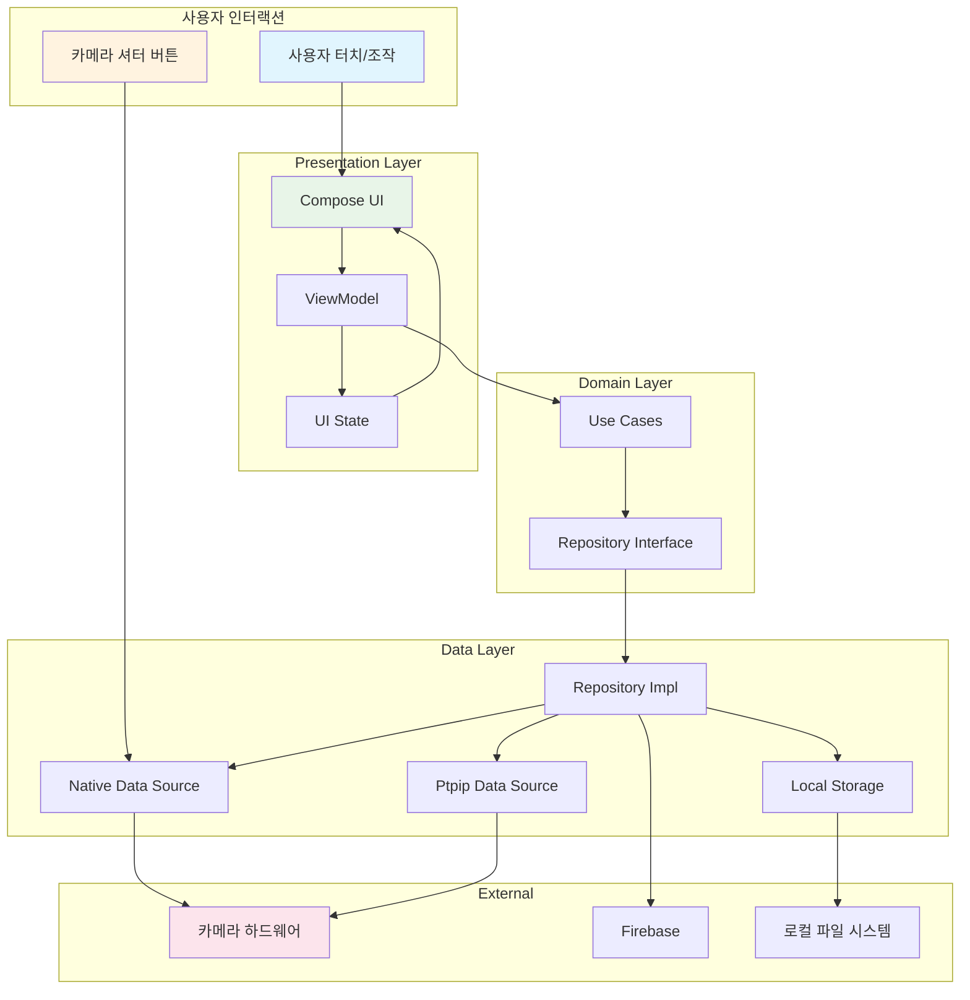
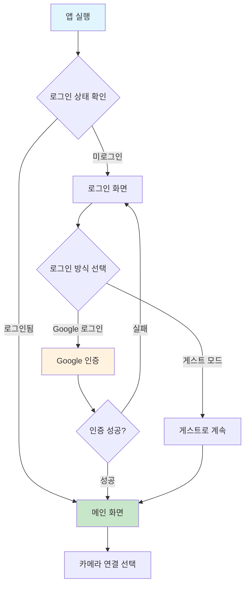
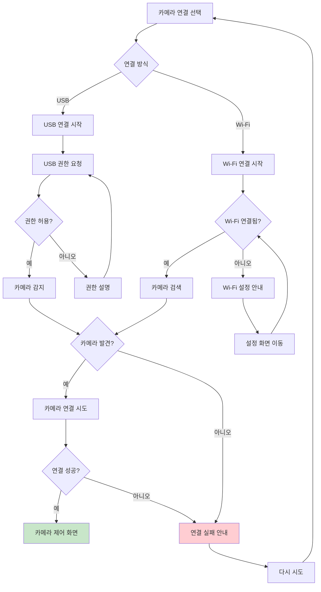
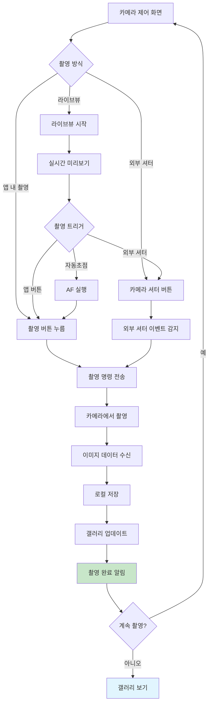
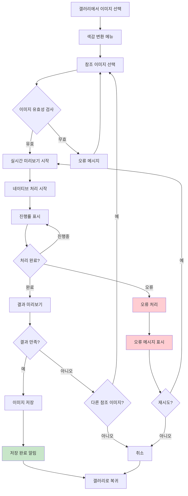
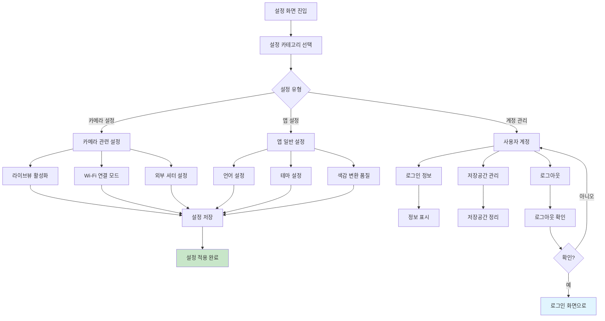

> **📢 퍼블릭 레포지토리**  
> 네이티브 코드와 민감한 파일들이 제외된 퍼블릭 버전입니다.  
> 마지막 동기화: $(date '+%Y-%m-%d %H:%M:%S UTC')

---

# CamConT - 전문 카메라 제어 애플리케이션

[](https://developer.android.com)
[](https://kotlinlang.org)
[](https://android-arsenal.com/api?level=29)

DSLR/미러리스 카메라를 안드로이드 기기로 완전히 제어할 수 있는 전문가용 카메라 제어 애플리케이션입니다. libgphoto2를 기반으로 하여 USB 및 Wi-Fi 연결을 통한
실시간 카메라 제어, 라이브뷰, 원격 촬영, 고급 색감 변환 등의 기능을 제공합니다.

## 주요 기능

### 카메라 연결 및 제어

- **USB OTG 연결**: 직접 USB 케이블 연결로 안정적인 카메라 제어
- **Wi-Fi PTP/IP 연결**: 무선으로 카메라 원격 제어 (AP 모드 + STA 모드)
- **자동 카메라 감지**: 연결된 카메라 자동 인식 및 최적화 설정
- **실시간 연결 상태**: 연결 상태 실시간 모니터링 및 자동 재연결

### 고급 촬영 기능

- **실시간 라이브뷰**: 고품질 실시간 미리보기 화면
- **자동초점(AF)**: 터치 자동초점 및 수동 초점 제어
- **원격 촬영**: 앱을 통한 원격 사진 촬영
- **외부 셔터 지원**: 카메라 본체 셔터 버튼으로 촬영 시 앱으로 자동 전송
- **다양한 촬영 모드**: 일반촬영, 연속촬영, 타임랩스 촬영

### 고급 색감 변환 (Color Transfer)

- **AI 기반 색감 매칭**: 참조 이미지의 색감을 타겟 이미지에 적용
- **실시간 미리보기**: 변환 결과 실시간 확인
- **고성능 처리**: 네이티브 C++ 구현으로 3-5배 빠른 처리 속도
- **스마트 메모리 관리**: 대용량 이미지도 안전하게 처리
- **다양한 포맷 지원**: JPEG, PNG, HEIC 등 주요 이미지 포맷

### 사용법

1. **카메라 연결**
    - USB OTG 케이블로 카메라와 안드로이드 기기 연결
    - 카메라 전원 ON 및 PC 연결 모드 설정
    - 앱에서 USB 권한 허용
    - 자동으로 카메라 감지 및 연결

2. **외부 셔터 버튼 활성화**
    - 설정에서 "외부 셔터 버튼" 활성화
    - 카메라 셔터 버튼 눌러서 촬영
    - 앱에 자동으로 사진 전송됨

3. **라이브뷰 사용**
    - 카메라 제어 화면에서 라이브뷰 시작
    - 실시간 화면 확인하며 구도 조정
    - 앱 또는 카메라 버튼으로 촬영

## 기술 스택

### Android Framework

- **언어**: Kotlin 1.9.20 (100%)
- **최소 SDK**: API 29 (Android 10)
- **타겟 SDK**: API 35
- **빌드 도구**: Android Gradle Plugin 8.8.0

### UI Framework

- **Jetpack Compose**: 1.5.4 - 현대적 선언형 UI
- **Material Design 3**: 1.1.2 - 최신 디자인 시스템
- **Navigation Compose**: 2.7.7 - 화면 간 네비게이션
- **Accompanist**: 0.32.0 - 시스템 UI 컨트롤

### 의존성 주입

- **Dagger Hilt**: 2.49 - DI 컨테이너
- **Hilt Navigation Compose**: 1.2.0

### 비동기 처리
- **Kotlin Coroutines**: 1.7.3 - 비동기 프로그래밍
- **StateFlow/Flow**: 반응형 데이터 스트림

### 인증 & 클라우드
- **Firebase BOM**: 33.4.0
- **Firebase Auth**: Google Sign-In
- **Google Play Services**: 21.0.0

### 네이티브 라이브러리
- **libgphoto2**: 카메라 제어 핵심 라이브러리
- **libusb**: USB 통신
- **CMake**: 3.22.1 - 네이티브 빌드 시스템
- **JNI**: Kotlin C++ 브리지

### 이미지 처리

- **Coil Compose**: 2.5.0 - 이미지 로딩/캐싱
- **GPUImage**: 2.1.0 - GPU 가속 이미지 처리
- **ExifInterface**: 1.4.1 - 메타데이터 처리

### 데이터 저장
- **DataStore Preferences**: 1.0.0 - 설정 저장
- **내부 저장소**: 촬영 사진 로컬 저장

## 아키텍처

### Clean Architecture + MVVM 패턴

```
┌─────────────────────────────────────────────────────────────────┐
│                    Presentation Layer                          │
│                                                                │
│  ┌─────────────┐  ┌─────────────┐  ┌─────────────┐             │
│  │   Jetpack   │  │ ViewModels  │  │ Activities/ │             │
│  │  Compose UI │  │   State     │  │  Screens    │             │
│  │             │  │ Management  │  │             │             │
│  └─────────────┘  └─────────────┘  └─────────────┘             │
│         │                 │                 │                  │
└─────────────────────────────────────────────────────────────────┘
          │                 │                 │
┌─────────────────────────────────────────────────────────────────┐
│                     Domain Layer                               │
│                                                                │
│  ┌─────────────┐  ┌─────────────┐  ┌─────────────┐             │
│  │  Use Cases  │  │ Repository  │  │   Domain    │             │
│  │ (Business   │  │ Interfaces  │  │   Models    │             │
│  │   Logic)    │  │             │  │             │             │
│  └─────────────┘  └─────────────┘  └─────────────┘             │
│         │                 │                 │                  │
└─────────────────────────────────────────────────────────────────┘
          │                 │                 │
┌─────────────────────────────────────────────────────────────────┐
│                      Data Layer                                │
│                                                                │
│  ┌─────────────┐  ┌─────────────┐  ┌─────────────┐             │
│  │ Repository  │  │    Data     │  │   Native    │             │
│  │ Impl        │  │   Sources   │  │   C++ Lib   │             │
│  │             │  │             │  │ (libgphoto2)│             │
│  └─────────────┘  └─────────────┘  └─────────────┘             │
│         │                 │                 │                  │
└─────────────────────────────────────────────────────────────────┘
          │                 │                 │
┌─────────────────────────────────────────────────────────────────┐
│                    External Layer                              │
│                                                                │
│  ┌─────────────┐  ┌─────────────┐  ┌─────────────┐             │
│  │  Firebase   │  │    USB      │  │   Wi-Fi     │             │
│  │  Services   │  │   Camera    │  │   Camera    │             │
│  │             │  │             │  │   (PTP/IP)  │             │
│  └─────────────┘  └─────────────┘  └─────────────┘             │
└─────────────────────────────────────────────────────────────────┘
```

### 데이터 플로우



## 사용자 플로우

### 1. 앱 시작 및 인증 플로우



### 2. 카메라 연결 플로우



### 3. 촬영 플로우



### 4. 색감 변환 플로우



### 5. 설정 및 관리 플로우



## 시작하기

### 시스템 요구사항

- **개발 환경**: Android Studio Hedgehog 이상
- **최소 Android 버전**: Android 10 (API 29)
- **권장 RAM**: 8GB 이상
- **저장 공간**: 최소 2GB 여유 공간

### 지원 하드웨어
- USB OTG 지원 안드로이드 기기
- Wi-Fi 지원 기기 (무선 연결 시)
- 카메라: Canon, Nikon, Sony, Fujifilm, Olympus 등 PTP 지원 카메라

## 사용 가이드

### USB 연결 방법

1. USB OTG 케이블로 카메라와 안드로이드 기기 연결
2. 카메라 전원 ON 및 PC 연결 모드 설정
3. 앱에서 USB 권한 허용
4. 자동으로 카메라 감지 및 연결

### Wi-Fi 연결 방법 (AP 모드)

1. 카메라를 Wi-Fi AP 모드로 설정
2. 안드로이드 기기에서 카메라 Wi-Fi 네트워크 연결
3. 앱 실행 후 PTP/IP 연결 선택
4. 자동 카메라 검색 및 연결

### Wi-Fi 연결 방법 (STA 모드)

1. 카메라와 안드로이드 기기를 동일한 Wi-Fi 네트워크에 연결
2. 카메라를 STA 모드로 설정
3. 앱에서 네트워크 내 카메라 검색
4. 감지된 카메라 선택하여 연결

### 색감 변환 사용법

1. 갤러리에서 변환할 이미지 선택
2. 색감 변환 메뉴 선택
3. 참조 이미지 선택 (원하는 색감의 이미지)
4. 실시간 미리보기 확인
5. 변환 적용 및 저장

## 고급 설정

### 카메라별 최적화 설정

- **Canon**: RAW+JPEG, AF 모드 자동 설정
- **Nikon**: 색공간 sRGB, 화질 최고로 설정
- **Sony**: 라이브뷰 자동 활성화, 파일 포맷 최적화
- **Fujifilm**: 필름 시뮬레이션 유지, 메타데이터 보존

### 성능 최적화

- 라이브뷰 품질 조정 (설정 > 카메라 > 라이브뷰 품질)
- 색감 변환 품질 설정 (고품질/표준/빠른 처리)
- 메모리 사용량 제한 설정
- 배터리 최적화 설정

## 다국어 지원

현재 지원되는 언어:

- 한국어 (Korean)
- 영어 (English)
- 일본어 (Japanese)
- 독일어 (German)
- 프랑스어 (French)
- 이탈리아어 (Italian)
- 중국어 (Chinese)

## 문제 해결

### 일반적인 문제

1. **카메라가 감지되지 않음**
    - USB 케이블 및 OTG 어댑터 확인
    - 카메라 PC 연결 모드 설정 확인
    - USB 권한 재설정

2. **Wi-Fi 연결 실패**
    - 네트워크 연결 상태 확인
    - 카메라 Wi-Fi 설정 재확인
    - 앱 Wi-Fi 권한 확인

3. **라이브뷰가 느림**
    - 라이브뷰 품질 조정
    - Wi-Fi 연결 시 네트워크 속도 확인
    - 기기 메모리 부족 여부 확인

4. **색감 변환 실패**
    - 이미지 크기 확인 (권장: 50MP 이하)
    - 여유 저장 공간 확인
    - 메모리 부족 시 앱 재시작


## 라이선스

이 프로젝트는 MIT 라이선스 하에 배포됩니다. 자세한 내용은 [LICENSE](LICENSE) 파일을 참조하세요.


## 지원 및 문의

- **이슈 리포트**: [GitHub Issues](https://github.com/yourusername/CamConT/issues)
- **기능 요청**: [GitHub Discussions](https://github.com/yourusername/CamConT/discussions)
- **이메일**: ppp5544@gmail.com

---
**CamConT** - Professional Camera Control & Color Transfer for Android
*Make Every Shot Perfect*
