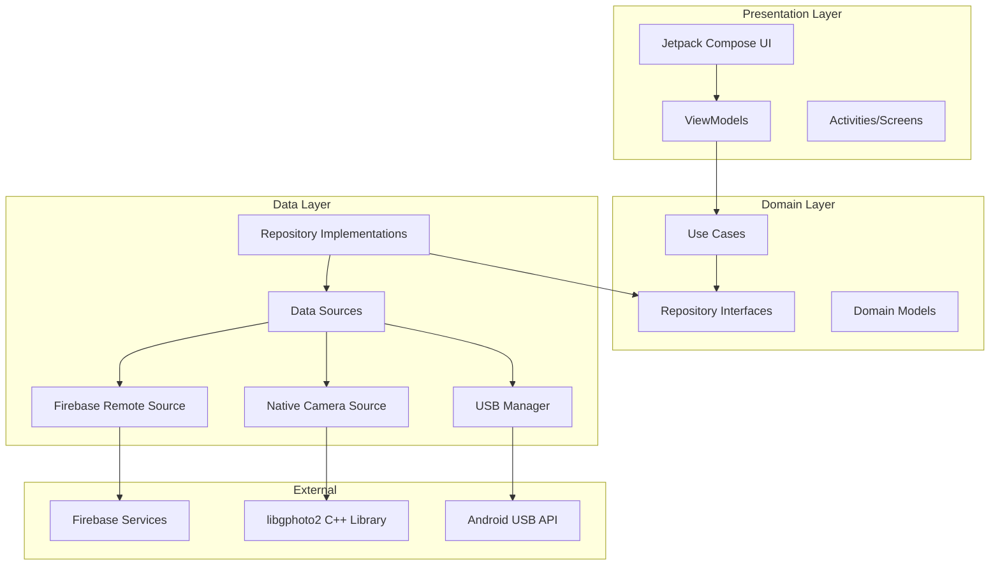
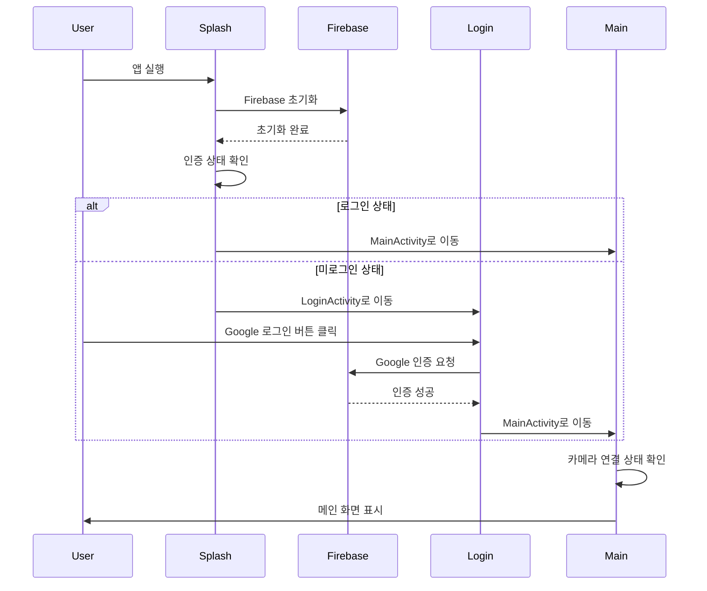
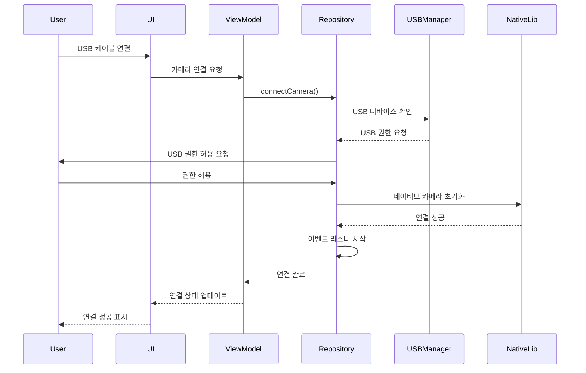
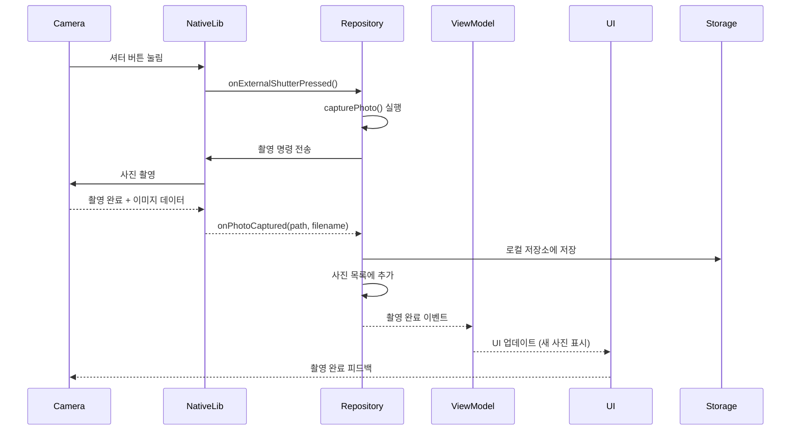
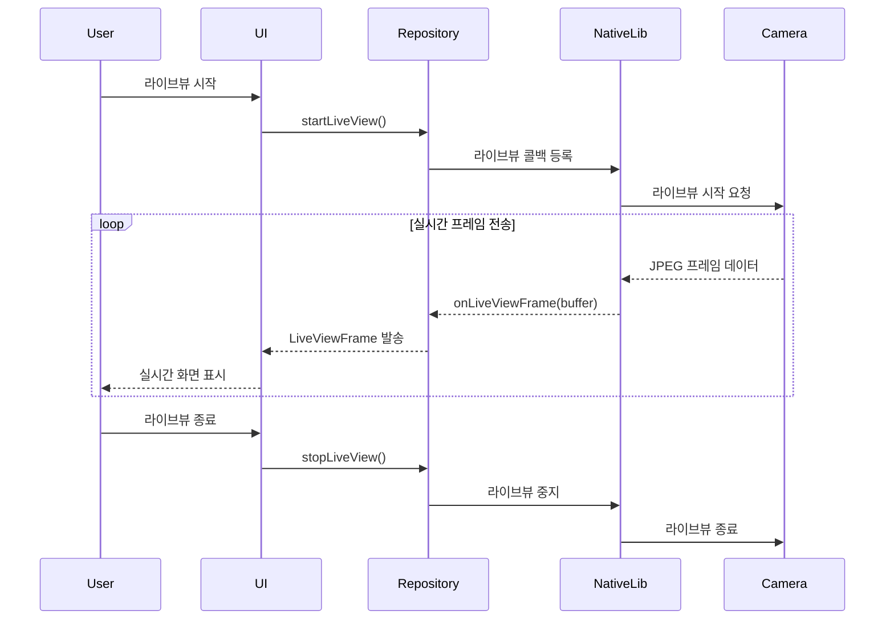
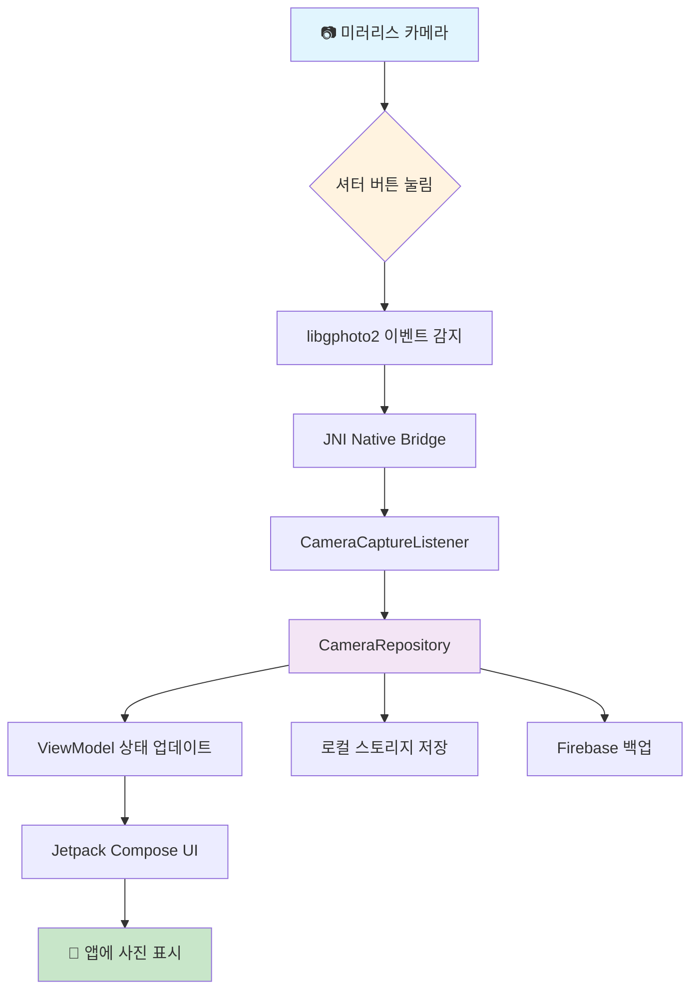

# CamCon - Camera Control Application

[](https://developer.android.com)
[](https://kotlinlang.org)
[](https://android-arsenal.com/api?level=29)

전문 카메라를 USB 연결을 통해 제어할 수 있는 안드로이드 애플리케이션입니다. libgphoto2 라이브러리를 사용하여 DSLR/미러리스 카메라의 실시간 제어 및 촬영 기능을
제공합니다.

## 📋 구현된 주요 기능

### ✅ 완료된 기능

#### 🔗 카메라 연결 및 제어

- **USB OTG 연결**: DSLR/미러리스 카메라 USB 연결
- **자동 카메라 감지**: 연결된 카메라 자동 인식
- **실시간 연결 상태**: 카메라 연결 상태 모니터링
- **카메라 정보 조회**: 모델명, 기능 등 상세 정보

#### 📸 촬영 기능

- **원격 촬영**: 앱을 통한 사진 촬영
- **🆕 외부 셔터 버튼 지원**: 카메라 본체 셔터 버튼 눌러도 앱으로 사진 전송
- **라이브뷰**: 실시간 카메라 미리보기
- **자동초점**: AF 기능 지원
- **타임랩스**: 자동 인터벌 촬영 (기본 구조 완료)
- **사진 이벤트 처리**: 촬영 완료 알림 및 관리

#### 🔐 사용자 인증

- **Firebase Authentication**: Google 소셜 로그인
- **자동 로그인**: 로그인 상태 유지
- **보안 세션**: 안전한 사용자 세션 관리

#### 📱 사용자 인터페이스

- **Jetpack Compose**: 현대적 선언형 UI
- **Material Design 3**: 최신 디자인 시스템
- **Dark/Light Theme**: 시스템 테마 자동 감지
- **반응형 레이아웃**: 다양한 화면 크기 지원

#### 🗂️ 파일 관리

- **로컬 사진 저장**: 촬영된 사진 기기 저장
- **사진 목록 관리**: 촬영된 사진 목록 및 미리보기
- **카메라 내부 파일**: 카메라 메모리카드 파일 목록 조회

## 🚧 개발 중인 기능

#### 📸 고급 촬영 모드

- **연속 촬영 (Burst Mode)**: 빠른 연속 촬영
- **브라케팅**: 노출 브라케팅 촬영
- **벌브 모드**: 장시간 노출 촬영
- **매뉴얼 포커스**: 수동 초점 조정

#### ⚙️ 카메라 설정

- **ISO 조정**: ISO 감도 설정
- **셔터 속도**: 셔터 스피드 조정
- **조리개 값**: F값 설정
- **화이트 밸런스**: WB 설정
- **노출 보정**: 노출 값 조정

#### ☁️ 클라우드 기능

- **Firebase Storage**: 클라우드 사진 저장
- **사진 동기화**: 자동 클라우드 백업
- **원격 접근**: 다른 기기에서 사진 접근

## 🏗️ 애플리케이션 아키텍처

### Clean Architecture + MVVM



## 🔄 애플리케이션 파이프라인

### 1. 앱 시작 플로우



### 2. 카메라 연결 플로우



### 3. 외부 셔터 버튼 촬영 플로우



### 4. 라이브뷰 스트리밍 플로우



## 📱 화면 와이어프레임

### 메인 플로우 화면 구성

```
┌─────────────────────────────────────────────────────────────────┐
│                         앱 와이어프레임                          │
└─────────────────────────────────────────────────────────────────┘

┌─────────────────┐    ┌─────────────────┐    ┌─────────────────┐
│   스플래시 화면   │────│   로그인 화면    │────│   메인 화면      │
│                │    │                │    │                │
│  ┌───────────┐  │    │  ┌───────────┐  │    │  ┌───────────┐  │
│  │CamCon 로고│  │    │  │Google 로그인│  │    │  │카메라 상태 │  │
│  │    📸     │  │    │  │    버튼    │  │    │  │  🔴 연결안됨│  │
│  └───────────┘  │    │  └───────────┘  │    │  └───────────┘  │
│                │    │                │    │                │
│   Loading...   │    │  ┌───────────┐  │    │  ┌───────────┐  │
│                │    │  │  로그인    │  │    │  │ 카메라 연결 │  │
│                │    │  │  건너뛰기   │  │    │  │    버튼    │  │
│                │    │  └───────────┘  │    │  └───────────┘  │
└─────────────────┘    └─────────────────┘    └─────────────────┘
         │                       │                       │
         │                       │                       │
         └───────────────────────────────────────────────┘
```

### 카메라 제어 화면

```
┌─────────────────────────────────────────────────────────────────┐
│                      카메라 제어 화면                            │
└─────────────────────────────────────────────────────────────────┘

┌─────────────────────────────────────────────────────────────────┐
│  ← 뒤로가기                카메라 제어              ⚙️ 설정      │
├─────────────────────────────────────────────────────────────────┤
│                                                                │
│  ┌─────────────────── 라이브뷰 화면 ───────────────────┐          │
│  │                                                   │          │
│  │              📹 실시간 카메라 화면                 │          │
│  │                                                   │          │
│  │                    [자동초점]                      │          │
│  │                                                   │          │
│  │               🎯 초점 포인트 표시                  │          │
│  │                                                   │          │
│  └───────────────────────────────────────────────────┘          │
│                                                                │
│  ┌─────────────── 카메라 설정 정보 ─────────────────┐              │
│  │ ISO: AUTO  │ 셔터: 1/125  │ 조리개: F2.8  │ WB: AUTO │          │
│  └─────────────────────────────────────────────────┘              │
│                                                                │
│  ┌─────────────── 촬영 컨트롤 ──────────────────┐                  │
│  │                                             │                  │
│  │    [📸 일반촬영]  [⚡ 연속촬영]  [⏰ 타임랩스]    │                  │
│  │                                             │                  │
│  │            🔵 큰 셔터 버튼                   │                  │
│  │                                             │                  │
│  │    💡 외부 셔터: ✅ 활성화                   │                  │
│  │                                             │                  │
│  └─────────────────────────────────────────────┘                  │
└─────────────────────────────────────────────────────────────────┘
```

### 사진 갤러리 화면

```
┌─────────────────────────────────────────────────────────────────┐
│                       사진 갤러리                               │
└─────────────────────────────────────────────────────────────────┘

┌─────────────────────────────────────────────────────────────────┐
│  ← 뒤로가기               촬영된 사진              🗂️ 카메라파일   │
├─────────────────────────────────────────────────────────────────┤
│                                                                │
│  ┌────────┐ ┌────────┐ ┌────────┐ ┌────────┐                    │
│  │  📸   │ │  📸   │ │  📸   │ │  📸   │                    │
│  │IMG_001│ │IMG_002│ │IMG_003│ │IMG_004│                    │
│  │2.1MB  │ │1.8MB  │ │2.4MB  │ │1.9MB  │                    │
│  │ 14:30 │ │ 14:25 │ │ 14:20 │ │ 14:15 │                    │
│  └────────┘ └────────┘ └────────┘ └────────┘                    │
│                                                                │
│  ┌────────┐ ┌────────┐ ┌────────┐ ┌────────┐                    │
│  │  📸   │ │  📸   │ │  📸   │ │  📸   │                    │
│  │IMG_005│ │IMG_006│ │IMG_007│ │IMG_008│                    │
│  │2.0MB  │ │2.2MB  │ │1.7MB  │ │2.3MB  │                    │
│  │ 14:10 │ │ 14:05 │ │ 14:00 │ │ 13:55 │                    │
│  └────────┘ └────────┘ └────────┘ └────────┘                    │
│                                                                │
│  ┌─────────────── 하단 액션 바 ────────────────┐                   │
│  │  [📤 공유]  [🗑️ 삭제]  [☁️ 백업]  [📁 폴더]   │                   │
│  └─────────────────────────────────────────────┘                   │
└─────────────────────────────────────────────────────────────────┘
```

### 설정 화면

```
┌─────────────────────────────────────────────────────────────────┐
│                         설정 화면                               │
└─────────────────────────────────────────────────────────────────┘

┌─────────────────────────────────────────────────────────────────┐
│  ← 뒤로가기                설정                                 │
├─────────────────────────────────────────────────────────────────┤
│                                                                │
│  📸 카메라 설정                                                 │
│  ├─ 외부 셔터 버튼      [✅ 활성화]                             │
│  ├─ 자동초점 모드       [AF-S ▼]                               │
│  ├─ 이미지 포맷         [RAW+JPEG ▼]                           │
│  ├─ 이미지 품질         [최고화질 ▼]                            │
│  └─ 저장 경로          [/Pictures/CamCon]                    │
│                                                                │
│  ⚙️ 앱 설정                                                     │
│  ├─ 테마               [시스템 따라가기 ▼]                       │
│  ├─ 언어               [한국어 ▼]                              │
│  ├─ 자동 백업          [☁️ 활성화]                             │
│  └─ 알림               [🔔 허용]                               │
│                                                                │
│  👤 계정                                                        │
│  ├─ 사용자 정보         [user@gmail.com]                       │
│  ├─ 저장공간 사용량     [2.1GB / 15GB]                         │
│  └─ 로그아웃           [🚪 로그아웃]                            │
│                                                                │
│  ℹ️ 정보                                                        │
│  ├─ 버전               [v1.0.0]                               │
│  ├─ 라이선스           [MIT License]                           │
│  └─ 문의하기           [📧 support@camcon.com]                │
└─────────────────────────────────────────────────────────────────┘
```

## 🔄 데이터 플로우 다이어그램

### 외부 셔터 버튼 → 앱 전송 플로우



## 🎯 화면별 주요 기능

### 1. 스플래시 화면 (SplashActivity)

- **기능**: 앱 초기화, Firebase 설정, 자동 로그인 체크
- **전환**: 로그인 상태에 따라 LoginActivity 또는 MainActivity로 이동

### 2. 로그인 화면 (LoginActivity)

- **기능**: Google 소셜 로그인, 게스트 모드
- **전환**: 로그인 성공 시 MainActivity로 이동

### 3. 메인 화면 (MainActivity)

- **기능**: 카메라 연결 상태, 네비게이션 허브
- **하위 화면**: 카메라 제어, 갤러리, 설정 화면

### 4. 카메라 제어 화면 (CameraControlScreen)

- **기능**:
    - 실시간 라이브뷰 📹
    - 촬영 버튼 (앱 내) 📸
    - 외부 셔터 버튼 활성화 🔘
    - 자동초점 🎯
    - 촬영 모드 선택 ⚙️
    - 카메라 설정 표시 📊

### 5. 사진 갤러리 (PhotoPreviewScreen & ServerPhotosScreen)

- **기능**:
    - 촬영된 사진 그리드 뷰 📷
    - 사진 미리보기 및 확대 🔍
    - 로컬/카메라 파일 전환 🗂️
    - 공유, 삭제, 백업 기능 📤

### 6. 설정 화면 (SettingsActivity)

- **기능**:
    - 외부 셔터 버튼 활성화/비활성화 🔘
    - 카메라 설정 (ISO, 셔터속도 등) ⚙️
    - 앱 설정 (테마, 언어 등) 🎨
    - 계정 관리 👤

## 🛠️ 기술 스택

### Android Framework

- **언어**: Kotlin 100%
- **최소 SDK**: API 29 (Android 10)
- **타겟 SDK**: API 35
- **아키텍처**: Clean Architecture + MVVM

### UI Framework

- **Jetpack Compose**: 1.7.8 - 선언형 UI
- **Material Design**: 1.7.8 - 최신 디자인 시스템
- **Navigation Compose**: 2.7.7 - 화면 전환
- **Accompanist**: 0.32.0 - 시스템 UI 제어

### 의존성 주입

- **Dagger Hilt**: 2.51.1 - DI 컨테이너
- **Hilt Navigation Compose**: 1.2.0

### 비동기 처리

- **Kotlin Coroutines**: 1.7.3 - 비동기 프로그래밍
- **Flow**: 상태 관리 및 데이터 스트림

### 인증 & 클라우드

- **Firebase BOM**: 33.4.0
- **Firebase Auth**: Google Sign-In 통합
- **Firebase Storage**: 사진 백업 (예정)
- **Google Play Services**: 21.0.0

### 이미지 처리

- **Coil Compose**: 2.5.0 - 이미지 로딩 및 캐싱

### 네이티브 라이브러리

- **libgphoto2**: 카메라 제어 핵심 라이브러리
- **libusb**: USB 통신
- **JNI**: Kotlin ↔ C++ 브리지
- **CMake**: 3.22.1 - 네이티브 빌드

### 데이터 저장

- **DataStore Preferences**: 1.0.0 - 설정 저장
- **내부 스토리지**: 촬영된 사진 로컬 저장

## 🚀 시작하기

### 사전 요구사항

- Android Studio Hedgehog 이상
- Android 10 (API 29) 이상 디바이스
- USB OTG 지원 안드로이드 기기
- 호환 DSLR/미러리스 카메라 (Canon, Nikon, Sony 등)
- USB-C to USB-A 어댑터 (필요시)

### 설치 및 실행

1. **프로젝트 클론**
```bash
git clone https://github.com/yourusername/CamCon.git
cd CamCon
```

2. **Firebase 설정**

- Firebase Console에서 프로젝트 생성
- Android 앱 추가 (패키지명: `com.inik.camcon`)
- `google-services.json` 파일을 `app/` 디렉토리에 배치
- Authentication에서 Google 로그인 활성화

3. **빌드 및 실행**
```bash
./gradlew assembleDebug
./gradlew installDebug
```

### 사용법

1. **카메라 연결**
    - USB OTG 케이블로 카메라와 안드로이드 기기 연결
    - 앱에서 USB 권한 허용
    - 카메라 전원 ON

2. **외부 셔터 버튼 활성화**
    - 설정에서 "외부 셔터 버튼" 활성화
    - 카메라 셔터 버튼 눌러서 촬영
    - 앱에 자동으로 사진 전송됨

3. **라이브뷰 사용**
    - 카메라 제어 화면에서 라이브뷰 시작
    - 실시간 화면 확인하며 구도 조정
    - 앱 또는 카메라 버튼으로 촬영

## 📄 라이선스

이 프로젝트는 MIT 라이선스 하에 배포됩니다. 자세한 내용은 [LICENSE](LICENSE) 파일을 참조하세요.

## 🤝 기여하기

1. Fork the Project
2. Create your Feature Branch (`git checkout -b feature/ExternalShutterButton`)
3. Commit your Changes (`git commit -m 'Add external shutter button support'`)
4. Push to the Branch (`git push origin feature/ExternalShutterButton`)
5. Open a Pull Request

## 📞 연락처

프로젝트 관련 문의사항이 있으시면 언제든지 연락주세요.

---

**CamCon** - Professional Camera Control for Android 📸✨

*최신 업데이트: 외부 셔터 버튼 지원 추가로 더욱 편리한 촬영 경험을 제공합니다.*
