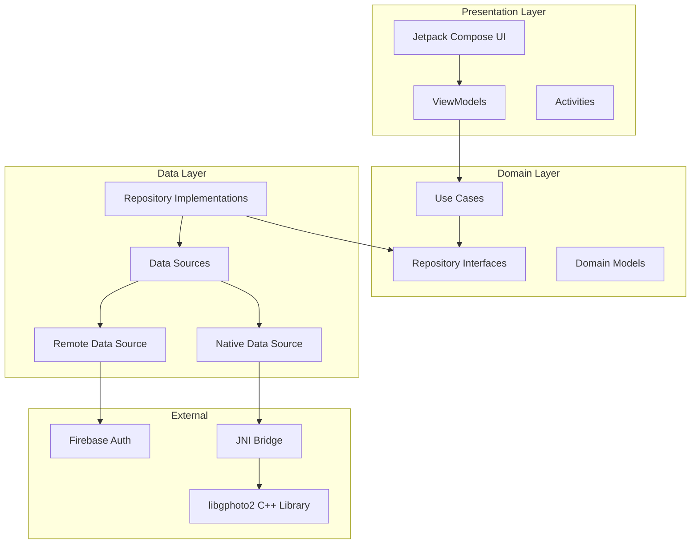
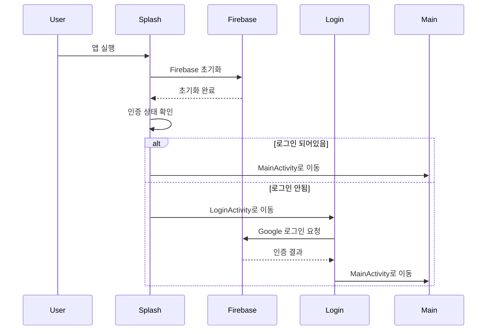
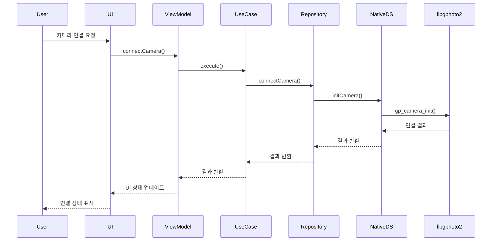
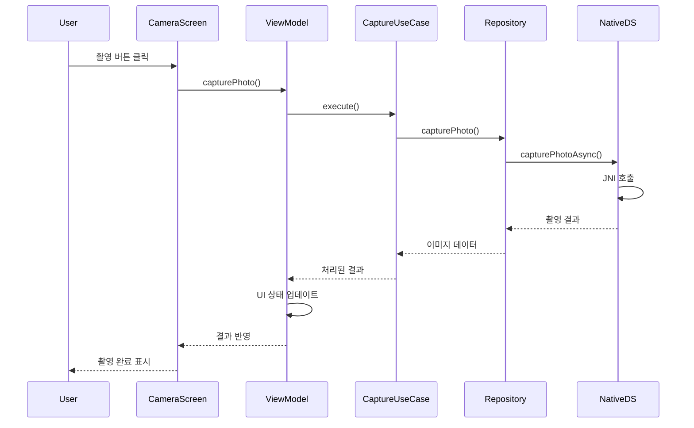

# CamConT - Camera Control Application

[](https://developer.android.com)
[](https://kotlinlang.org)
[](https://android-arsenal.com/api?level=29)

전문 카메라를 USB 연결을 통해 제어할 수 있는 안드로이드 애플리케이션입니다. libgphoto2 라이브러리를 사용하여 DSLR/미러리스 카메라의 실시간 제어 및 촬영 기능을
제공합니다.

## 📋 주요 기능

- **실시간 카메라 제어**: USB OTG를 통한 DSLR/미러리스 카메라 제어
- **라이브뷰**: 실시간 카메라 미리보기
- **원격 촬영**: 앱을 통한 사진 촬영 및 저장
- **타임랩스**: 자동 인터벌 촬영
- **사용자 인증**: Firebase Authentication을 통한 Google 로그인
- **클라우드 동기화**: 촬영한 사진의 클라우드 저장 및 관리

## 🏗️ 아키텍처

### Clean Architecture + MVVM



### 계층별 설명

#### 1. Presentation Layer (프레젠테이션 계층)

- **Jetpack Compose**: 현대적인 선언형 UI 프레임워크
- **ViewModels**: UI 상태 관리 및 비즈니스 로직 연결
- **Activities**: 화면 전환 및 시스템 이벤트 처리

#### 2. Domain Layer (도메인 계층)

- **Use Cases**: 비즈니스 로직의 단일 책임 구현
- **Repository Interfaces**: 데이터 접근 추상화
- **Domain Models**: 핵심 비즈니스 모델

#### 3. Data Layer (데이터 계층)

- **Repository Implementations**: 데이터 소스 통합 관리
- **Data Sources**: 외부 데이터 소스와의 인터페이스
- **JNI Bridge**: 네이티브 C++ 코드와의 연결

## 🔧 기술 스택

### Android Framework

- **언어**: Kotlin
- **최소 SDK**: API 29 (Android 10)
- **타겟 SDK**: API 35
- **아키텍처**: Clean Architecture + MVVM

### UI Framework

- **Jetpack Compose**: 1.7.8
- **Material Design**: 1.7.8
- **Navigation Compose**: 2.7.7
- **Accompanist**: 0.32.0 (System UI Controller)

### 의존성 주입

- **Dagger Hilt**: 2.51.1
- **Hilt Navigation Compose**: 1.2.0

### 비동기 처리

- **Kotlin Coroutines**: 1.7.3
- **Coroutines Play Services**: 1.7.3

### 인증 & 클라우드

- **Firebase BOM**: 33.4.0
- **Firebase Auth**: Google Sign-In
- **Firebase Analytics**
- **Firebase Messaging**: FCM
- **Google Play Services Auth**: 21.0.0
- **Credential Manager**: 1.3.0

### 이미지 처리

- **Coil Compose**: 2.5.0

### 데이터 저장

- **DataStore Preferences**: 1.0.0

### 네이티브 라이브러리

- **libgphoto2**: 카메라 제어 라이브러리
- **libusb**: USB 통신
- **CMake**: 3.22.1

## 📁 프로젝트 구조

```
com.inik.camcon/
├── 📁 data/
│   ├── 📁 datasource/
│   │   ├── 📁 nativesource/
│   │   │   ├── NativeCameraDataSource.kt
│   │   │   ├── CameraCaptureListener.kt
│   │   │   └── LiveViewCallback.kt
│   │   └── 📁 remote/
│   │       ├── AuthRemoteDataSource.kt
│   │       └── AuthRemoteDataSourceImpl.kt
│   └── 📁 repository/
│       ├── AuthRepositoryImpl.kt
│       └── CameraRepositoryImpl.kt
├── 📁 domain/
│   ├── 📁 model/
│   ├── 📁 repository/
│   │   ├── AuthRepository.kt
│   │   └── CameraRepository.kt
│   └── 📁 usecase/
│       ├── 📁 auth/
│       │   └── SignInWithGoogleUseCase.kt
│       ├── 📁 camera/
│       │   └── StartTimelapseUseCase.kt
│       ├── CapturePhotoUseCase.kt
│       └── GetCameraFeedUseCase.kt
├── 📁 presentation/
│   ├── 📁 theme/
│   │   ├── Color.kt
│   │   ├── Theme.kt
│   │   └── Type.kt
│   ├── 📁 ui/
│   │   ├── 📁 screens/
│   │   │   ├── CameraControlScreen.kt
│   │   │   ├── PhotoPreviewScreen.kt
│   │   │   └── ServerPhotosScreen.kt
│   │   ├── LoginActivity.kt
│   │   ├── MainActivity.kt
│   │   ├── SettingsActivity.kt
│   │   └── SplashActivity.kt
│   └── 📁 viewmodel/
├── 📁 di/
│   ├── AppModule.kt
│   └── RepositoryModule.kt
├── CamCon.kt (Application)
└── CameraNative.kt (JNI Interface)
```

## 🔄 애플리케이션 플로우

### 1. 앱 시작 플로우



### 2. 카메라 제어 플로우



### 3. 촬영 플로우



## 🎯 화면 구성

### 1. 스플래시 화면 (SplashActivity)

- 앱 초기화 및 로딩
- Firebase 초기화
- 인증 상태 확인

### 2. 로그인 화면 (LoginActivity)

- Google 소셜 로그인
- Firebase Authentication
- 사용자 인증 처리

### 3. 메인 화면 (MainActivity)

- 카메라 연결 상태 표시
- 네비게이션 허브
- 주요 기능 접근점

### 4. 카메라 제어 화면 (CameraControlScreen)

- 실시간 라이브뷰
- 촬영 컨트롤
- 카메라 설정 조정
- 타임랩스 설정

### 5. 사진 미리보기 (PhotoPreviewScreen)

- 촬영된 사진 확인
- 편집 및 공유 기능

### 6. 서버 사진 관리 (ServerPhotosScreen)

- 클라우드 사진 목록
- 다운로드 및 삭제

### 7. 설정 화면 (SettingsActivity)

- 앱 설정 관리
- 카메라 연결 설정
- 사용자 프로필

## 🔌 JNI 인터페이스

### CameraNative.kt

- libgphoto2와의 네이티브 연결
- 카메라 기능 래핑
- 비동기 이벤트 처리

```kotlin
// 주요 네이티브 메서드
external fun initCamera(): String
external fun capturePhotoAsync(callback: CameraCaptureListener)
external fun startLiveView(callback: LiveViewCallback)
external fun getCameraSummary(): String
external fun detectCamera(): String
```

## 📦 의존성 관리

### Dagger Hilt 모듈

#### AppModule

```kotlin
@Module
@InstallIn(SingletonComponent::class)
object AppModule {
    @Provides @Singleton
    fun provideFirebaseAuth(): FirebaseAuth
    
    @Provides @Singleton
    fun provideNativeCameraDataSource(): NativeCameraDataSource
}
```

#### RepositoryModule

```kotlin
@Module
@InstallIn(SingletonComponent::class)
abstract class RepositoryModule {
    @Binds @Singleton
    abstract fun bindCameraRepository(impl: CameraRepositoryImpl): CameraRepository
    
    @Binds @Singleton
    abstract fun bindAuthRepository(impl: AuthRepositoryImpl): AuthRepository
}
```

## 🚀 시작하기

### 사전 요구사항

- Android Studio Arctic Fox 이상
- Android 10 (API 29) 이상
- USB OTG 지원 디바이스
- 호환 DSLR/미러리스 카메라

### 설치 및 실행

1. **프로젝트 클론**

```bash
git clone https://github.com/yourusername/CamConT.git
cd CamConT
```

2. **Firebase 설정**

- [Firebase Console](https://console.firebase.google.com/)에서 프로젝트 생성
- Android 앱 추가 (패키지명: `com.inik.camcon`)
- `google-services.json` 파일을 `app/` 디렉토리에 배치
- Firebase Authentication에서 Google 로그인 활성화

3. **빌드 및 실행**

```bash
./gradlew assembleDebug
./gradlew installDebug
```

## 🎨 UI/UX 특징

- **Material Design 3**: 최신 디자인 시스템 적용
- **Dark/Light Theme**: 시스템 테마 자동 감지
- **반응형 레이아웃**: 다양한 화면 크기 지원
- **접근성**: 스크린 리더 및 터치 접근성 고려
- **사용자 친화적**: 직관적인 카메라 제어 인터페이스

## 🔧 개발 도구

- **Android Studio**: Hedgehog 이상
- **CMake**: 3.22.1
- **NDK**: 최신 버전
- **Gradle**: 8.0+

## 📄 라이선스

이 프로젝트는 MIT 라이선스 하에 배포됩니다. 자세한 내용은 [LICENSE](LICENSE) 파일을 참조하세요.

## 🤝 기여하기

1. Fork the Project
2. Create your Feature Branch (`git checkout -b feature/AmazingFeature`)
3. Commit your Changes (`git commit -m 'Add some AmazingFeature'`)
4. Push to the Branch (`git push origin feature/AmazingFeature`)
5. Open a Pull Request

## 📞 연락처

프로젝트 관련 문의사항이 있으시면 언제든지 연락주세요.

---

**CamConT** - Professional Camera Control for Android 📸