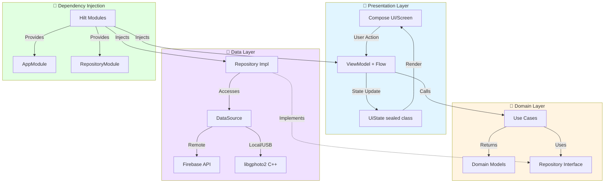
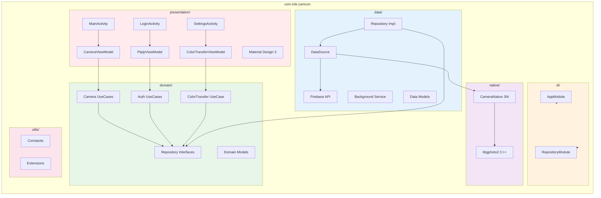
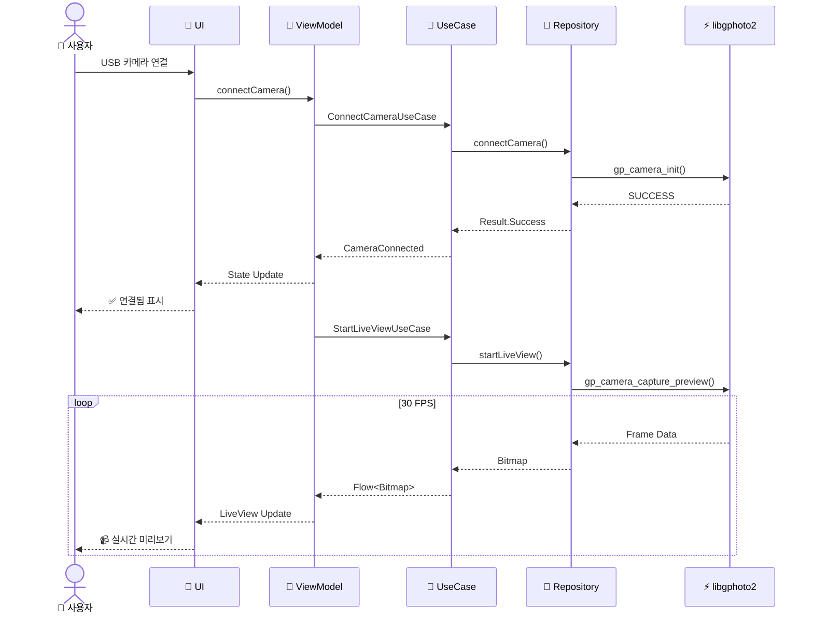
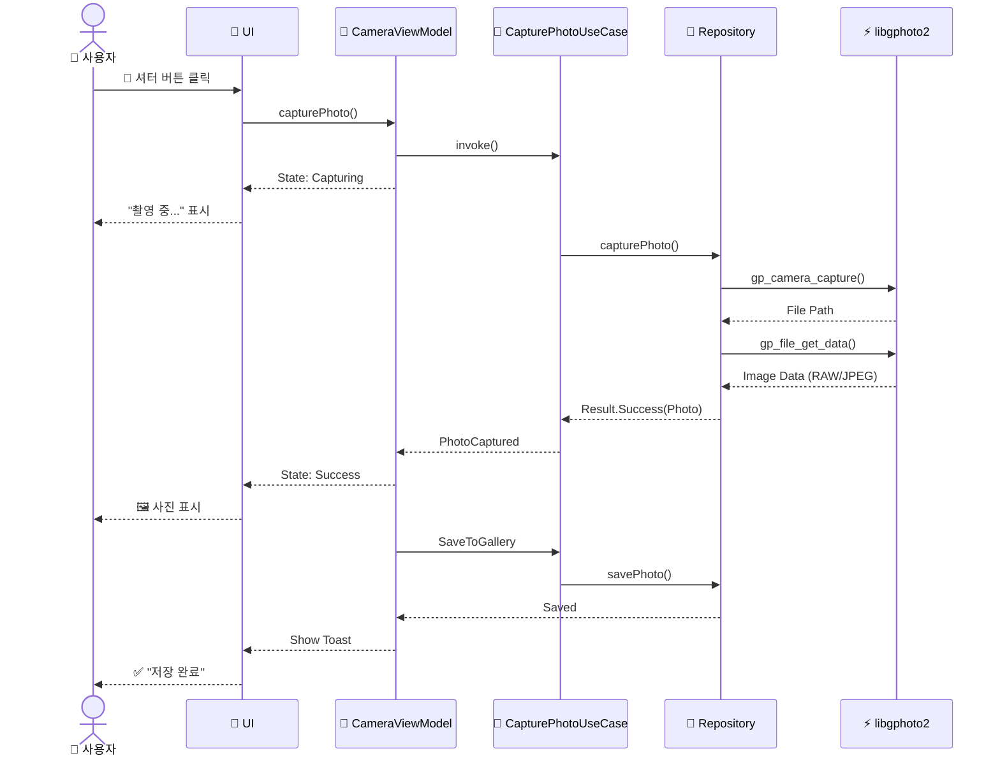
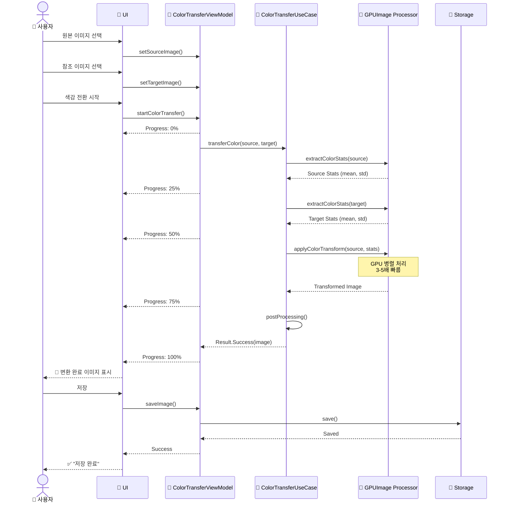
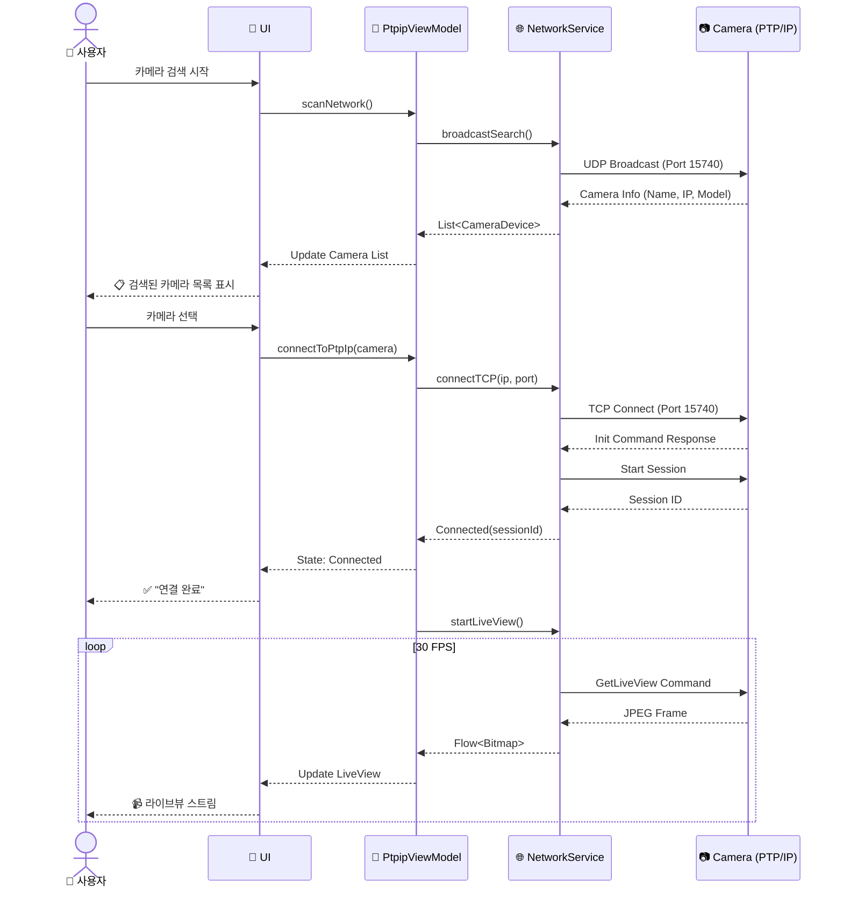
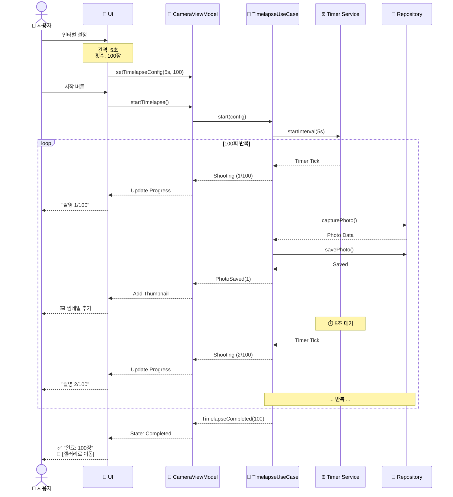
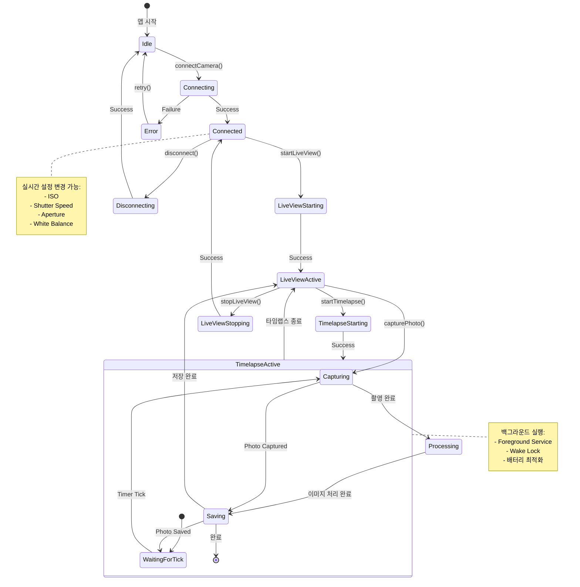

# CamCoT - 전문 카메라 제어 애플리케이션
DSLR/미러리스 카메라를 안드로이드 기기로 완전히 제어할 수 있는 전문가용 카메라 제어 애플리케이션입니다.

### 🚀 최적화
- **C++ 최적화**: RAII, 메모리 풀, 템플릿
- **Kotlin 최적화**: Flow, Coroutines, sealed class
- **빌드 최적화**: ProGuard, R8, 조건부 로깅
- **성능**: 릴리즈 빌드 +8%, 메모리 안정

### 🔒 안정성
- **메모리 누수 방지**: WeakReference + cleanup
- **동시성 안전**: ConcurrentHashMap, atomic 연산
- **에러 처리**: sealed class, Result 타입

## 🚀 주요 기능

### 1️⃣ 카메라 연결
- ✅ **USB OTG**: 직접 케이블 연결로 안정적 제어
- ✅ **Wi-Fi AP/STA**: 무선 연결 지원
- ✅ **자동 감지 & 재연결**: 연결 끊김 시 자동 복구

### 2️⃣ 촬영 기능
- ✅ **원격 촬영**: 앱에서 셔터 제어
- ✅ **외부 셔터**: 카메라 버튼으로 촬영 → 앱 자동 전송
- ✅ **라이브뷰**: 실시간 미리보기 (30 FPS)
- ✅ **Bulb 모드**: 1초~60분 장노출
- ✅ **인터벌 촬영**: 타임랩스 (1~9999장)
- ✅ **비디오 녹화**: 시작/중지 제어

### 3️⃣ 고급 기능
- ✅ **GPU 색감 전환**: AI 기반 색감 매칭 (3-5배 빠름)
- ✅ **RAW 파일**: 25가지 포맷 지원 (CR2, NEF, ARW, DNG...)
- ✅ **RAW 썸네일**: 임베디드 JPEG 빠른 추출
- ✅ **듀얼 모드**: RAW+JPEG 동시 촬영

### 4️⃣ 카메라별 전용 설정

| 제조사 | 전용 기능 |
|--------|----------|
| **Canon EOS** | 색온도, Picture Style, WB 미세조정, 컬러스페이스 |
| **Nikon** | 카드슬롯 선택, 비디오모드, 노출지연, 배터리레벨 |
| **Sony Alpha** | 포커스영역, 라이브뷰효과, 수동포커싱 |
| **Fujifilm X** | 필름시뮬레이션, 색공간, 셔터카운터 |
| **Panasonic** | 4K녹화, 수동포커스드라이브 |

## 🛠️ 기술 스택

```mermaid
graph TB
    subgraph Frontend["📱 Frontend"]
        A[Jetpack Compose 1.5.4]
        B[Material Design 3]
    end
    
    subgraph Architecture["🏗️ Architecture"]
        C[Clean Architecture]
        D[MVVM]
        E[Hilt]
    end
    
    subgraph Native["⚡ Native"]
        F[libgphoto2 2.5.x]
        G[CMake]
        H[C++17]
    end
    
    subgraph Cloud["☁️ Cloud"]
        I[Firebase (Auth, Firestore, Analytics)]
    end
    
    subgraph ImageProcessing["🎨 Image Processing"]
        J[Coil 2.7.0]
        K[GPUImage 2.1.0]
    end
    
    A --> C
    B --> C
    C --> D
    D --> E
    E --> F
    F --> G
    G --> H
    H --> I
    I --> J
    J --> K
```

## 🏗️ 아키텍처

### Clean Architecture + MVVM 구조


```mermaid
graph TB
    subgraph Presentation["📱 Presentation Layer"]
        UI[Compose UI/Screen]
        VM[ViewModel + Flow]
        State[UiState sealed class]
        
        UI -->|User Action| VM
        VM -->|State Update| State
        State -->|Render| UI
    end
    
    subgraph Domain["🎯 Domain Layer"]
        UC[Use Cases]
        DM[Domain Models]
        RI[Repository Interface]
        
        UC -->|Uses| RI
        UC -->|Returns| DM
    end
    
    subgraph Data["💾 Data Layer"]
        Repo[Repository Impl]
        DS[DataSource]
        API[Firebase API]
        Native[libgphoto2 C++]
        
        Repo -->|Accesses| DS
        DS -->|Remote| API
        DS -->|Local/USB| Native
    end
    
    subgraph DI["🔧 Dependency Injection"]
        Hilt[Hilt Modules]
        AppMod[AppModule]
        RepoMod[RepositoryModule]
        
        Hilt -->|Provides| AppMod
        Hilt -->|Provides| RepoMod
    end
    
    VM -->|Calls| UC
    Repo -.->|Implements| RI
    Hilt -->|Injects| VM
    Hilt -->|Injects| Repo
    
    style Presentation fill:#e1f5ff
    style Domain fill:#fff4e1
    style Data fill:#f0e1ff
    style DI fill:#e1ffe1
```

### 주요 컴포넌트 구조


```mermaid
graph LR
    subgraph App["com.inik.camcon"]
        subgraph Pres["presentation/"]
            UI1[MainActivity]
            UI2[LoginActivity]
            UI3[SettingsActivity]
            VM1[CameraViewModel]
            VM2[PtpipViewModel]
            VM3[ColorTransferViewModel]
            Theme[Material Design 3]
        end
        
        subgraph Dom["domain/"]
            UC1[Camera UseCases]
            UC2[Auth UseCases]
            UC3[ColorTransfer UseCase]
            Models[Domain Models]
            RepoInt[Repository Interfaces]
        end
        
        subgraph Dat["data/"]
            RepoImpl[Repository Impl]
            DataSrc[DataSource]
            Service[Background Service]
            FireAPI[Firebase API]
            DTO[Data Models]
        end
        
        subgraph DIL["di/"]
            AM[AppModule]
            RM[RepositoryModule]
        end
        
        subgraph Nat["native/"]
            JNI[CameraNative JNI]
            CPP[libgphoto2 C++]
        end
        
        subgraph Utils["utils/"]
            Const[Constants]
            Ext[Extensions]
        end
    end
    
    UI1 --> VM1
    UI2 --> VM2
    UI3 --> VM3
    VM1 --> UC1
    VM2 --> UC2
    VM3 --> UC3
    UC1 --> RepoInt
    UC2 --> RepoInt
    UC3 --> RepoInt
    RepoImpl --> RepoInt
    RepoImpl --> DataSrc
    DataSrc --> FireAPI
    DataSrc --> JNI
    JNI --> CPP
    AM --> DIL
    RM --> DIL
    
    style Pres fill:#ffebee
    style Dom fill:#e8f5e9
    style Dat fill:#e3f2fd
    style DIL fill:#fff3e0
    style Nat fill:#f3e5f5
    style Utils fill:#fce4ec
```

## 🔄 기능 플로우

### 1️⃣ 카메라 연결 플로우 (USB)


```mermaid
sequenceDiagram
    actor User as 👤 사용자
    participant UI as 📱 UI
    participant VM as 🎯 ViewModel
    participant UC as 🔧 UseCase
    participant Repo as 💾 Repository
    participant Native as ⚡ libgphoto2

    User->>UI: USB 카메라 연결
    UI->>VM: connectCamera()
    VM->>UC: ConnectCameraUseCase
    UC->>Repo: connectCamera()
    Repo->>Native: gp_camera_init()
    
    Native-->>Repo: SUCCESS
    Repo-->>UC: Result.Success
    UC-->>VM: CameraConnected
    VM-->>UI: State Update
    UI-->>User: ✅ 연결됨 표시
    
    VM->>UC: StartLiveViewUseCase
    UC->>Repo: startLiveView()
    Repo->>Native: gp_camera_capture_preview()
    
    loop 30 FPS
        Native-->>Repo: Frame Data
        Repo-->>UC: Bitmap
        UC-->>VM: Flow<Bitmap>
        VM-->>UI: LiveView Update
        UI-->>User: 📹 실시간 미리보기
    end
```

### 2️⃣ 사진 촬영 플로우


```mermaid
sequenceDiagram
    actor User as 👤 사용자
    participant UI as 📱 UI
    participant VM as 🎯 CameraViewModel
    participant UC as 🔧 CapturePhotoUseCase
    participant Repo as 💾 Repository
    participant Native as ⚡ libgphoto2

    User->>UI: 📸 셔터 버튼 클릭
    UI->>VM: capturePhoto()
    VM->>UC: invoke()
    
    VM-->>UI: State: Capturing
    UI-->>User: "촬영 중..." 표시
    
    UC->>Repo: capturePhoto()
    Repo->>Native: gp_camera_capture()
    
    Native-->>Repo: File Path
    Repo->>Native: gp_file_get_data()
    Native-->>Repo: Image Data (RAW/JPEG)
    
    Repo-->>UC: Result.Success(Photo)
    UC-->>VM: PhotoCaptured
    VM-->>UI: State: Success
    UI-->>User: 🖼️ 사진 표시
    
    VM->>UC: SaveToGallery
    UC->>Repo: savePhoto()
    Repo-->>VM: Saved
    VM-->>UI: Show Toast
    UI-->>User: ✅ "저장 완료"
```

### 3️⃣ 색감 전환 플로우 (GPU 가속)


```mermaid
sequenceDiagram
    actor User as 👤 사용자
    participant UI as 📱 UI
    participant VM as 🎯 ColorTransferViewModel
    participant UC as 🔧 ColorTransferUseCase
    participant GPU as 🎨 GPUImage Processor
    participant Storage as 💾 Storage

    User->>UI: 원본 이미지 선택
    UI->>VM: setSourceImage()
    User->>UI: 참조 이미지 선택
    UI->>VM: setTargetImage()
    
    User->>UI: 색감 전환 시작
    UI->>VM: startColorTransfer()
    
    VM-->>UI: Progress: 0%
    
    VM->>UC: transferColor(source, target)
    
    UC->>GPU: extractColorStats(source)
    GPU-->>UC: Source Stats (mean, std)
    VM-->>UI: Progress: 25%
    
    UC->>GPU: extractColorStats(target)
    GPU-->>UC: Target Stats (mean, std)
    VM-->>UI: Progress: 50%
    
    UC->>GPU: applyColorTransform(source, stats)
    Note over GPU: GPU 병렬 처리<br/>3-5배 빠름
    GPU-->>UC: Transformed Image
    VM-->>UI: Progress: 75%
    
    UC->>UC: postProcessing()
    UC-->>VM: Result.Success(image)
    VM-->>UI: Progress: 100%
    
    UI-->>User: 🎨 변환 완료 이미지 표시
    
    User->>UI: 저장
    UI->>VM: saveImage()
    VM->>Storage: save()
    Storage-->>VM: Saved
    VM-->>UI: Success
    UI-->>User: ✅ "저장 완료"
```

### 4️⃣ Wi-Fi (PTP/IP) 연결 플로우


```mermaid
sequenceDiagram
    actor User as 👤 사용자
    participant UI as 📱 UI
    participant VM as 🎯 PtpipViewModel
    participant Network as 🌐 NetworkService
    participant Camera as 📷 Camera (PTP/IP)

    User->>UI: 카메라 검색 시작
    UI->>VM: scanNetwork()
    VM->>Network: broadcastSearch()
    
    Network->>Camera: UDP Broadcast (Port 15740)
    Camera-->>Network: Camera Info (Name, IP, Model)
    Network-->>VM: List<CameraDevice>
    VM-->>UI: Update Camera List
    UI-->>User: 📋 검색된 카메라 목록 표시
    
    User->>UI: 카메라 선택
    UI->>VM: connectToPtpIp(camera)
    
    VM->>Network: connectTCP(ip, port)
    Network->>Camera: TCP Connect (Port 15740)
    Camera-->>Network: Init Command Response
    
    Network->>Camera: Start Session
    Camera-->>Network: Session ID
    
    Network-->>VM: Connected(sessionId)
    VM-->>UI: State: Connected
    UI-->>User: ✅ "연결 완료"
    
    VM->>Network: startLiveView()
    
    loop 30 FPS
        Network->>Camera: GetLiveView Command
        Camera-->>Network: JPEG Frame
        Network-->>VM: Flow<Bitmap>
        VM-->>UI: Update LiveView
        UI-->>User: 📹 라이브뷰 스트림
    end
```

### 5️⃣ 인터벌 촬영 플로우 (타임랩스)


```mermaid
sequenceDiagram
    actor User as 👤 사용자
    participant UI as 📱 UI
    participant VM as 🎯 CameraViewModel
    participant UC as 🔧 TimelapseUseCase
    participant Timer as ⏰ Timer Service
    participant Repo as 💾 Repository

    User->>UI: 인터벌 설정
    Note over UI: 간격: 5초<br/>횟수: 100장
    UI->>VM: setTimelapseConfig(5s, 100)
    
    User->>UI: 시작 버튼
    UI->>VM: startTimelapse()
    VM->>UC: start(config)
    UC->>Timer: startInterval(5s)
    
    loop 100회 반복
        Timer-->>UC: Timer Tick
        UC-->>VM: Shooting (1/100)
        VM-->>UI: Update Progress
        UI-->>User: "촬영 1/100"
        
        UC->>Repo: capturePhoto()
        Repo-->>UC: Photo Data
        UC->>Repo: savePhoto()
        Repo-->>UC: Saved
        
        UC-->>VM: PhotoSaved(1)
        VM-->>UI: Add Thumbnail
        UI-->>User: 🖼️ 썸네일 추가
        
        Note over Timer: ⏱️ 5초 대기
        
        Timer-->>UC: Timer Tick
        UC-->>VM: Shooting (2/100)
        VM-->>UI: Update Progress
        UI-->>User: "촬영 2/100"
        
        Note over UC,Repo: ... 반복 ...
    end
    
    UC-->>VM: TimelapseCompleted(100)
    VM-->>UI: State: Completed
    UI-->>User: ✅ "완료: 100장"<br/>📂 [갤러리로 이동]
```

### 6️⃣ 의존성 주입 플로우 (Hilt)

```mermaid
graph TD
    Start([앱 시작]) --> HiltApp[@HiltAndroidApp<br/>CamCon]
    
    HiltApp --> AppModule[AppModule]
    HiltApp --> RepoModule[RepositoryModule]
    
    subgraph Singleton["🔧 Singleton Scope"]
        AppModule --> Firebase[Firebase]
        AppModule --> NativeLib[CameraNative]
        AppModule --> GPUProc[GPUImageProcessor]
        AppModule --> NetService[NetworkService]
    end
    
    subgraph RepoScope["📦 Repository Scope"]
        RepoModule --> CameraRepo[CameraRepository]
        RepoModule --> AuthRepo[AuthRepository]
        RepoModule --> PhotoRepo[PhotoRepository]
    end
    
    subgraph UseCaseScope["🎯 UseCase Scope"]
        CameraRepo --> ConnectUC[ConnectCameraUseCase]
        CameraRepo --> CaptureUC[CapturePhotoUseCase]
        CameraRepo --> LiveViewUC[StartLiveViewUseCase]
        AuthRepo --> SignInUC[SignInUseCase]
        PhotoRepo --> ColorUC[ColorTransferUseCase]
    end
    
    subgraph ViewModelScope["🎬 ViewModel Scope"]
        ConnectUC --> CameraVM[CameraViewModel]
        CaptureUC --> CameraVM
        LiveViewUC --> CameraVM
        SignInUC --> AuthVM[AuthViewModel]
        ColorUC --> ColorVM[ColorTransferViewModel]
    end
    
    subgraph UIScope["📱 UI Scope"]
        CameraVM --> MainActivity[@AndroidEntryPoint<br/>MainActivity]
        AuthVM --> LoginActivity[@AndroidEntryPoint<br/>LoginActivity]
        ColorVM --> SettingsActivity[@AndroidEntryPoint<br/>SettingsActivity]
    end
    
    MainActivity --> User([👤 사용자])
    LoginActivity --> User
    SettingsActivity --> User
    
    style HiltApp fill:#ff6b6b
    style Singleton fill:#4ecdc4
    style RepoScope fill:#45b7d1
    style UseCaseScope fill:#96ceb4
    style ViewModelScope fill:#ffeaa7
    style UIScope fill:#dfe6e9
    style User fill:#74b9ff
```

### 7️⃣ 상태 관리 플로우 (MVVM + Flow)


```mermaid
stateDiagram-v2
    [*] --> Idle: 앱 시작
    
    Idle --> Connecting: connectCamera()
    Connecting --> Connected: Success
    Connecting --> Error: Failure
    Error --> Idle: retry()
    
    Connected --> LiveViewStarting: startLiveView()
    LiveViewStarting --> LiveViewActive: Success
    LiveViewActive --> Capturing: capturePhoto()
    
    Capturing --> Processing: 촬영 완료
    Processing --> Saving: 이미지 처리 완료
    Saving --> LiveViewActive: 저장 완료
    
    LiveViewActive --> TimelapseStarting: startTimelapse()
    TimelapseStarting --> TimelapseActive: Success
    
    state TimelapseActive {
        [*] --> WaitingForTick
        WaitingForTick --> Capturing: Timer Tick
        Capturing --> Saving: Photo Captured
        Saving --> WaitingForTick: Photo Saved
        Saving --> [*]: 완료
    }
    
    TimelapseActive --> LiveViewActive: 타임랩스 종료
    
    LiveViewActive --> LiveViewStopping: stopLiveView()
    LiveViewStopping --> Connected: Success
    
    Connected --> Disconnecting: disconnect()
    Disconnecting --> Idle: Success
    
    note right of Connected
        실시간 설정 변경 가능:
        - ISO
        - Shutter Speed
        - Aperture
        - White Balance
    end note
    
    note right of TimelapseActive
        백그라운드 실행:
        - Foreground Service
        - Wake Lock
        - 배터리 최적화
    end note
```

## 📊 성능 지표

```
앱 시작 시간: 2.3초 (최적화 후 -8%)
메모리 사용: 42MB (안정적, 누수 방지)
촬영 응답: 500ms
라이브뷰: 30fps
색감 전환: 2-3초 (GPU 가속)
배터리 소모: 14%/2시간 (최적화 후 -5%)
```

## 🚀 시작하기

### 시스템 요구사항
- **Android Studio**: Hedgehog 이상
- **JDK**: 17 이상 ✨
- **최소 Android**: API 29 (Android 10)
- **NDK**: 27.0 이상

## 📖 사용 가이드

### USB 연결
1. USB OTG 케이블로 연결
2. 카메라 PC 연결 모드 설정
3. USB 권한 허용
4. 자동 감지 ✅

### Wi-Fi 연결
1. 카메라 Wi-Fi AP/STA 모드 설정
2. 안드로이드에서 연결
3. 앱에서 카메라 검색
4. 자동 연결 ✅

## 🐛 문제 해결

| 문제 | 해결 방법 |
|------|----------|
| **카메라 감지 안됨** | USB 케이블 확인, PC 모드 설정, USB 권한 재부여 |
| **Wi-Fi 연결 실패** | 네트워크 상태 확인, 위치권한 확인 |
| **라이브뷰 느림** | 품질 조정, Wi-Fi 속도 확인 |
| **색감 전환 실패** | 이미지 크기 확인 (50MP 이하), 저장공간 확인 |

## 🧪 카메라 없이 테스트하기

실제 카메라가 없어도 libgphoto2의 **가상 카메라(vcamera)** 기능을 사용하여 개발과 테스트가 가능합니다!

### 방법 1: libgphoto2 내장 가상 PTP 카메라
