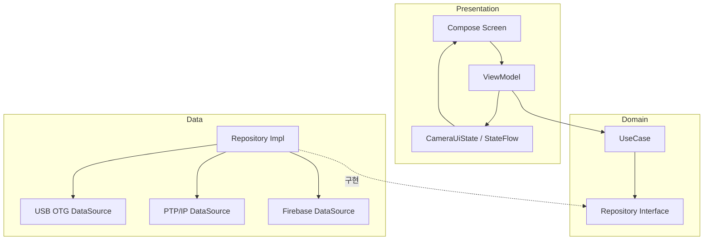

# CamCon

**DSLR·미러리스 카메라를 안드로이드에 연결해, 촬영과 동시에 필름룩 사진을 폰으로 받는 앱.**

Google Play 출시 · 개인 개발 · 2025년 4월부터 개발 중

[**Google Play에서 보기**](https://play.google.com/store/apps/details?id=com.inik.camcon) ·
[**camcon.inik.kr**](https://camcon.inik.kr)

> *An Android tethered-shooting app for DSLR/mirrorless cameras. Shoot, and the
> film-simulated photo lands on your phone. Available on Google Play.*

---

## 무엇을 하는 앱인가

카메라를 USB OTG 케이블이나 Wi-Fi로 폰에 연결하면,

- **폰에서 셔터를 누르거나**, **카메라 본체 셔터를 눌러도** 사진이 폰으로 넘어온다
- 넘어오는 즉시 **필름 시뮬레이션 LUT**가 적용된다 (296종)
- 라이브뷰로 실시간 미리보기를 보며 ISO·셔터·조리개·화이트밸런스를 바꾼다
- RAW를 원본 그대로 받는다 (31개 확장자 인식 — CR2/CR3, NEF/NRW, ARW, DNG …)

현장에서 노트북을 펴지 않고 테더링 촬영을 하려고 만들었다.

## 이 저장소에 대해

CamCon은 상용 앱이라 **네이티브 레이어·서버 로직·결제는 비공개**로 두고, 앱 코드와 개발
이력을 이 저장소에 공개한다.

| 공개 | 비공개 |
|---|---|
| Compose UI · ViewModel · UseCase · Repository | libgphoto2 안드로이드 포팅과 JNI 브리지 |
| Clean Architecture 전체 구조 | Cloud Functions (영수증 검증·계정) |
| 단위 테스트 871개 | 구독·결제·레퍼럴 |
| PTP/IP 클라이언트 구조 | 서명 키·Firebase 설정 |

네이티브 레이어를 비공개로 두는 이유는, libgphoto2를 안드로이드로 크로스컴파일해
16KB 페이지 정렬·동적 로딩·camlib 배치까지 맞춰 넣는 작업이 참고할 선례가 거의 없어
직접 부딪혀 만든 부분이기 때문이다.

libgphoto2는 LGPL-2.1이며 CamCon은 이를 수정해 사용한다. **수정된 대응 소스는 요청 시
제공**한다 (앱 내 `설정 → 오픈소스 라이선스`에 고지). 문의: `ppp5544@gmail.com`

> 이 저장소는 개발 저장소에서 자동 동기화된 것이라 그대로 빌드되지 않는다.
> 실제로 동작하는 앱은 Google Play에서 받을 수 있다.

## 규모

| | |
|---|---|
| Kotlin 소스 | 379개 파일 |
| 단위 테스트 | 116개 파일 · **871개 테스트** |
| 커밋 | **514개** (2025-04-16 ~ ) |
| 지원 언어 | 8개 (ko·en·ja·zh·de·es·fr·it) |
| 필름 시뮬레이션 | 296종 |
| 카메라 드라이버 등재 | 945기종 |

## 기술 스택

- **Kotlin** · **Jetpack Compose** + Material 3 (다크 테마 고정)
- **Clean Architecture + MVVM**, 단방향 데이터 흐름
- **Hilt + KSP** 의존성 주입
- **Coroutines / Flow** (RxJava 없음)
- **Firebase** Auth · Firestore · Remote Config
- **GPUImage** 기반 LUT 파이프라인
- minSdk 29 (Android 10) · targetSdk 36 · arm64-v8a

## 아키텍처

```mermaid
graph TB
    subgraph P["Presentation"]
        UI[Compose Screen] --> VM[ViewModel]
        VM --> ST[CameraUiState / StateFlow]
        ST --> UI
    end
    subgraph D["Domain"]
        UC[UseCase] --> RI[Repository Interface]
    end
    subgraph DA["Data"]
        RP[Repository Impl] --> USB[USB OTG DataSource]
        RP --> PTP[PTP/IP DataSource]
        RP --> FB[Firebase DataSource]
    end
    VM --> UC
    RP -.구현.-> RI
```

의존 방향은 `presentation → domain ← data`. ViewModel은 로직을 직접 갖지 않고 기능별
매니저(촬영·설정·연결·에러 처리)에 위임한다.

**연결 모드는 두 가지다.**

- **USB OTG** — `NativeCameraDataSource` → JNI → libgphoto2
- **Wi-Fi PTP/IP** — `PtpipDataSource` → TCP(15740) + mDNS/SSDP 탐색

## 현재 동작 범위

솔직하게 적는다. 아래는 실제로 동작하는 것이다.

- ✅ USB OTG 연결 · Wi-Fi(PTP/IP) 연결
- ✅ 단일 촬영 (앱 셔터 / 카메라 본체 셔터 양쪽)
- ✅ 라이브뷰 + 노출 설정 실시간 변경
- ✅ 필름 시뮬레이션 자동 적용
- ✅ RAW 수신 · 갤러리 저장 · EXIF 보존

아래는 **아직 구현되지 않았다.** 실행하면 미지원 안내가 뜬다.

- ⛔ 연사(BURST) · 인터벌/타임랩스 · HDR 브라케팅 · 벌브(BULB)

무선 촬영은 Nikon Z 계열에서 검증했고, 나머지 제조사는 USB 연결 위주로 확인했다.

## 라이선스

`LICENSE` 참조. 소스는 열람·학습 목적으로 공개하며, 저작권은 저작자에게 있다.

---

**Kim Tae Hwan** · [camcon.inik.kr](https://camcon.inik.kr) · `ppp5544@gmail.com`
